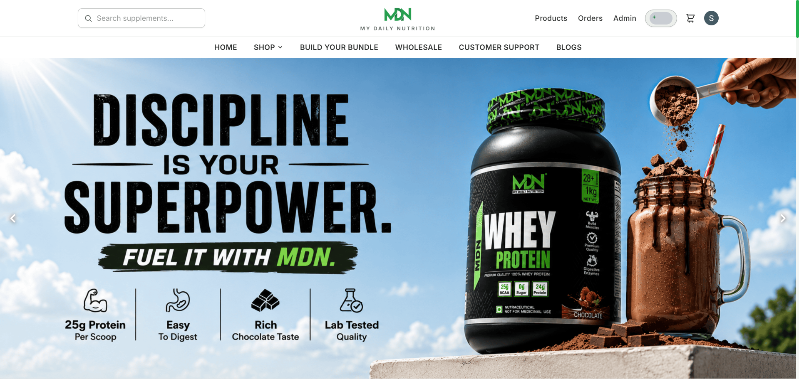

# MDN – My Daily Nutrition

A full-stack e-commerce platform for supplements and fitness nutrition, built on the MERN stack (MongoDB, Express, React, Node.js). Includes a customer-facing storefront and a full admin panel for managing products, orders, coupons, users, and enquiries.

## 🌐 Live Demo

🚀 **Live Website:** https://mdn-my-daily-nutrition.vercel.app/

## 📸 Screenshot

<p align="center">
  
</p>

## Features

### Customer
- Google OAuth login — no manual registration, account created on first sign-in
- Browse products by section (Best Sellers, New Arrivals, Fitness Combos) and category
- Product listing with filtering (category, product type, fitness goal), sorting (price, rating) and pagination
- Live search with autocomplete suggestions and relevance ranking
- Product detail pages with independent size and flavor pickers, nutrition facts, benefit strip, and reviews
- Review counts are always the real number of reviews, and rise as customers add them
- Product reviews and 5-star ratings, with duplicate-review prevention
- Guest cart (no login required) that syncs to a persistent cart after login
- Coupon codes — percentage and flat discounts with min-order value, max-discount cap, and expiry
- Online payments via **Razorpay**, with server-side signature verification
- Profile page showing account info (name, email, avatar) with full address management — add, edit, and delete saved addresses
- Address picker at checkout to ship to any saved address, or enter a new one on the fly
- Order tracking with a visual status timeline, and order cancellation for eligible orders
- Contact form (login-gated) that continues the conversation on WhatsApp, with a QR code fallback
- Blog listing and detail pages, plus a customer support page
- Related products carousel on every product page, drawn from the same product type, then the same category, then the wider catalogue
- Dark / light theme toggle, smooth scrolling, scroll-triggered animations
- Horizontal carousels driven by trackpad gestures, drag, and arrow buttons
- Toast notifications for cart, checkout, and order actions

### Admin
- Product management (add, edit, categories) with image uploads via Cloudinary
- Per-product display rating — set the star count and the numeric value shown on cards and the product page, or leave blank to use the average of real customer reviews
- Soft delete and permanent delete on separate routes, so an accidental delete can only deactivate
- Order management — update status, tracking number, courier partner, estimated delivery / delivered dates, with required-field validation for key statuses
- Coupon management
- User management (block/unblock, view orders)
- Enquiry inbox — triage contact submissions as new / in progress / resolved

## Tech Stack

### Frontend (`/client`)
- React 19 + Vite
- React Router 7
- Tailwind CSS 3 — every colour, radius, shadow, easing and duration is a CSS custom property in a single token layer, so the whole storefront reskins from one file and dark mode is a token remap rather than a second stylesheet
- Self-hosted Didot (woff2) for display type, Jost for navigation chrome, Inter for body and data
- Material UI (`@mui/material`, `@mui/icons-material`) with Emotion
- Motion (Framer Motion) for scroll reveals and parallax
- Lenis for inertial smooth scrolling
- Google OAuth (`@react-oauth/google`)
- Razorpay Checkout JS SDK
- Context API for auth, cart badge, toast, theme, and site settings
- Route-level code splitting (`React.lazy` + `Suspense`) and per-route error boundaries

### Backend (`/server`)
- Node.js + Express 5
- MongoDB with Mongoose 9
- Google OAuth verification (`google-auth-library`) + JWT access/refresh session tokens
- Razorpay order creation and HMAC-SHA256 payment signature verification
- Cloudinary for product image storage (via Multer + `multer-storage-cloudinary`)
- REST API with route-level middleware for auth and role-based access control

## Authentication

- **Google OAuth 2.0** — passwordless. The Google ID token is verified server-side against the OAuth client ID; the client-supplied identity is never trusted.
- **JWT dual-token strategy** — a 15-minute access token plus a 7-day refresh token stored on the user document (`select: false`).
- **Silent refresh** — the API client intercepts `401`s, rotates the access token, and retries the original request. Concurrent 401s share a single in-flight refresh.
- **Role-based access control** — `customer` / `admin` / `superadmin`, enforced by chained Express middleware and matching React route guards.
- **Blocked users** are rejected at the auth middleware, invalidating existing tokens immediately.

## Payments

Checkout runs a two-step server flow: `POST /api/orders/create-razorpay-order` → Razorpay Checkout modal → `POST /api/orders/verify-payment`.

- The payment signature is verified with HMAC-SHA256 before an order is created
- Order pricing is recalculated server-side from live product data, so a tampered client price cannot change what is charged
- Stock is decremented atomically with a `$gte` guard to prevent overselling, and rolled back if any line fails
- Cancelling an eligible order restores its stock

## Project Structure

```text
MDN-Suppliment-Website/
├── client/
│   ├── public/
│   │   └── fonts/          # self-hosted Didot woff2
│   ├── src/
│   │   ├── api/
│   │   ├── assets/
│   │   ├── components/
│   │   ├── context/
│   │   ├── data/
│   │   ├── hooks/
│   │   ├── lib/
│   │   ├── pages/
│   │   ├── styles/
│   │   └── utils/
│   └── .env
│
└── server/
    ├── config/
    ├── controller/
    ├── middleware/
    ├── models/
    ├── routes/
    ├── scripts/
    ├── utils/
    ├── database.js
    ├── server.js
    └── .env
```

## Getting Started

### Prerequisites

- Node.js (v18 or later)
- MongoDB (local installation or MongoDB Atlas)
- A Cloudinary account (for image uploads)
- A Google Cloud project with an OAuth 2.0 Client ID configured
- A Razorpay account (test keys are fine for local development)

### 1. Clone the Repository

```bash
git clone https://github.com/sachin-codes01/MERN-Projects.git
```

```bash
cd MERN-Projects/MDN-Suppliment-Website
```

### 2. Backend Setup

```bash
cd server
```

```bash
npm install
```

Create a `.env` file inside the `server` directory (see [Environment Variables](#environment-variables)), then start the server:

```bash
npm run dev
```

### 3. Frontend Setup

```bash
cd ../client
```

```bash
npm install
```

Create a `.env` file inside the `client` directory, then start the dev server:

```bash
npm run dev
```

The application will be available at `http://localhost:5173`.

## Environment Variables

### Backend (`server/.env`)

```env
PORT=5000
MONGO_URI=your_mongodb_connection_string
JWT_SECRET=your_jwt_secret
JWT_REFRESH_SECRET=your_jwt_refresh_secret
GOOGLE_CLIENT_ID=your_google_oauth_client_id
CLOUDINARY_CLOUD_NAME=your_cloudinary_cloud_name
CLOUDINARY_API_KEY=your_cloudinary_api_key
CLOUDINARY_API_SECRET=your_cloudinary_api_secret
RAZORPAY_KEY_ID=your_razorpay_key_id
RAZORPAY_KEY_SECRET=your_razorpay_key_secret
```

### Frontend (`client/.env`)

```env
VITE_BASE_URL=http://localhost:5000/api
VITE_GOOGLE_CLIENT_ID=your_google_oauth_client_id
VITE_RAZORPAY_KEY_ID=your_razorpay_key_id
```

> Both `.env` files are excluded from version control using `.gitignore`.

## Seed Scripts

Run from the `server` directory:

```bash
npm run seed:products
```

```bash
npm run seed:reviews
```

## Deployment

- **Frontend** is deployed on [Vercel](https://vercel.com). Environment variables are set under Project Settings → Environment Variables, and a redeploy is triggered manually after any change since Vercel doesn't auto-redeploy on env var updates alone.
- **Backend** is deployed on [Render](https://render.com). Environment variables are set under the service's Environment tab, which triggers an automatic redeploy on save.
- The Google Cloud Console OAuth Client must have the deployed frontend URL added under **Authorized JavaScript origins** for Google login to work in production.

## Tech Highlights

- MERN Stack Architecture
- Google OAuth Authentication with JWT Access/Refresh Token Rotation
- Razorpay Payment Gateway with HMAC-SHA256 Signature Verification
- Atomic Stock Management with Rollback on Failure
- Role-based Admin Dashboard
- Cloudinary Image Uploads
- RESTful API with a consistent response envelope
- Guest Cart with Login Synchronization
- Multi-Address Profile Management with Checkout Address Picker
- Coupon Management System
- Order Tracking Timeline
- Autocomplete Search with Relevance Ranking
- Responsive UI with Tailwind CSS, dark mode, and reduced-motion support
- Code Splitting, Lazy Loading, and Error Boundaries
- Context API State Management

## License

This project is for personal and educational purposes. Feel free to fork and modify it for learning.
