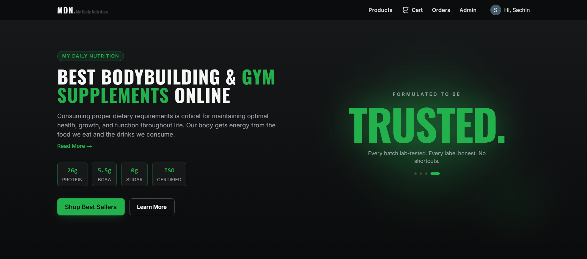

# MDN Suppliment Website

A full-stack e-commerce platform for supplements and fitness nutrition, built on the MERN stack (MongoDB, Express, React, Node.js). Includes a customer-facing storefront and a full admin panel for managing products, orders, coupons, and users.

## 🌐 Live Demo

🚀 **Live Website:** https://mdn-my-daily-nutrition.vercel.app/

## 📸 Screenshot

<p align="center">
  
</p>

## Features

### Customer
- Google OAuth login — no manual registration, account created on first sign-in
- Browse products by section (Best Sellers, New Arrivals, Fitness Combos) and category
- Product detail pages with variant selection (flavor, weight) and reviews
- Guest cart (no login required) that syncs to a persistent cart after login
- Coupon codes applied at checkout
- Profile page showing account info (name, email, avatar) with full address management — add, edit, and delete saved addresses
- Address picker at checkout to ship to any saved address, or enter a new one on the fly
- Order placement (Cash on Delivery) and order tracking with a visual status timeline
- Order cancellation for eligible orders
- Toast notifications for cart, checkout, and order actions
- Search across products

### Admin
- Product management (add, edit, categories) with image uploads via Cloudinary
- Order management — update status, tracking number, courier partner, estimated delivery / delivered dates, with required-field validation for key statuses
- Coupon management
- User management (block/unblock, view orders)

## Tech Stack

### Frontend (`/client`)
- React + Vite
- React Router
- Tailwind CSS
- Google OAuth (`@react-oauth/google`)
- Context API for auth, cart badge, and toast notifications

### Backend (`/server`)
- Node.js + Express
- MongoDB with Mongoose
- Google OAuth verification + JWT-based session tokens
- Cloudinary for product image storage (via Multer + `multer-storage-cloudinary`)
- REST API with route-level middleware for auth and admin access control

## Project Structure

```text
MDN-Suppliment-Website/
├── client/                   
│   ├── public/
│   ├── src/
│   │   ├── api/              
│   │   ├── components/       
│   │   ├── context/          
│   │   ├── pages/            
│   │   ├── styles/
│   │   └── utils/
│   └── .env                  
│
└── server/                   
    ├── config/               
    ├── controller/           
    ├── middleware/           
    ├── models/               
    ├── routes/               
    ├── database.js
    ├── server.js
    └── .env                  
```

## Getting Started

### Prerequisites

- Node.js (v18 or later)
- MongoDB (Local installation or MongoDB Atlas)
- A Cloudinary account (for image uploads)
- A Google Cloud project with an OAuth 2.0 Client ID configured

### 1. Clone the Repository

```bash
git clone https://github.com/sachin-codes01/MERN-Projects.git
cd MERN-Projects/MDN-Suppliment-Website
```

### 2. Backend Setup

Install dependencies:

```bash
cd server
npm install
```

Create a `.env` file inside the `server` directory:

```env
PORT=5000
MONGO_URI=your_mongodb_connection_string
JWT_SECRET=your_jwt_secret
GOOGLE_CLIENT_ID=your_google_oauth_client_id
CLOUDINARY_CLOUD_NAME=your_cloudinary_cloud_name
CLOUDINARY_API_KEY=your_cloudinary_api_key
CLOUDINARY_API_SECRET=your_cloudinary_api_secret
```

Start the backend server:

```bash
npm run dev
```

### 3. Frontend Setup

Install dependencies:

```bash
cd ../client
npm install
```

Create a `.env` file inside the `client` directory:

```env
VITE_BASE_URL=http://localhost:5000/api
VITE_GOOGLE_CLIENT_ID=your_google_oauth_client_id
```

Start the frontend:

```bash
npm run dev
```

The application will be available at:

```text
http://localhost:5173
```

## Environment Variables

### Backend (`server/.env`)

```env
PORT=5000
MONGO_URI=your_mongodb_connection_string
JWT_SECRET=your_jwt_secret
GOOGLE_CLIENT_ID=your_google_oauth_client_id
CLOUDINARY_CLOUD_NAME=your_cloudinary_cloud_name
CLOUDINARY_API_KEY=your_cloudinary_api_key
CLOUDINARY_API_SECRET=your_cloudinary_api_secret
```

### Frontend (`client/.env`)

```env
VITE_BASE_URL=http://localhost:5000/api
VITE_GOOGLE_CLIENT_ID=your_google_oauth_client_id
```

> Both `.env` files are excluded from version control using `.gitignore`.

## Deployment

- **Frontend** is deployed on [Vercel](https://vercel.com). Environment variables are set under Project Settings → Environment Variables, and a redeploy is triggered manually after any change since Vercel doesn't auto-redeploy on env var updates alone.
- **Backend** is deployed on [Render](https://render.com). Environment variables are set under the service's Environment tab, which triggers an automatic redeploy on save.
- The Google Cloud Console OAuth Client must have the deployed frontend URL added under **Authorized JavaScript origins** for Google login to work in production.

## Tech Highlights

- MERN Stack Architecture
- Google OAuth Authentication & JWT Session Handling
- Role-based Admin Dashboard
- Cloudinary Image Uploads
- RESTful API
- Responsive UI with Tailwind CSS
- Guest Cart with Login Synchronization
- Multi-Address Profile Management with Checkout Address Picker
- Coupon Management System
- Order Tracking Timeline
- Search Functionality
- Context API State Management

## License

This project is for personal and educational purposes. Feel free to fork and modify it for learning.