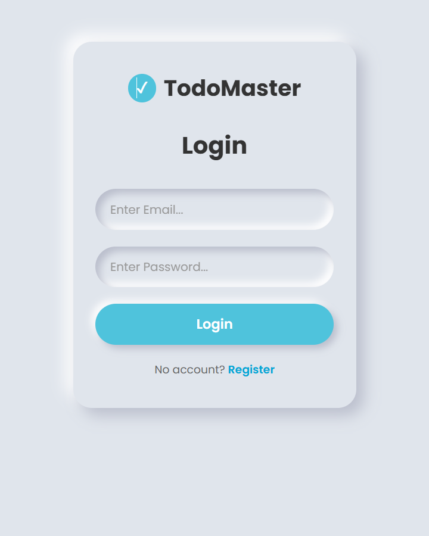
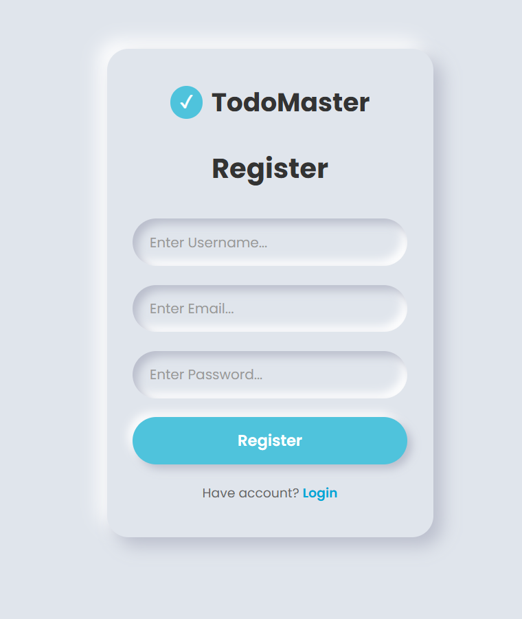
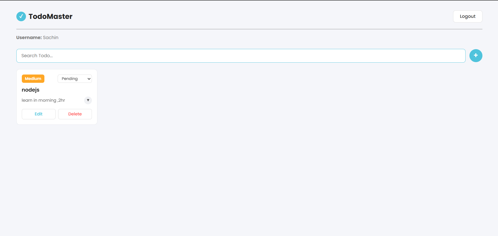

# ✓ TodoMaster

A full-stack MERN (MongoDB, Express, React, Node.js) todo management application with user authentication. Users can register, log in, and manage their personal tasks with title, description, status, and priority tracking.

## Screenshots

<table width="800">
  <tr>
    <td width="50%" hight="100%"></td>
    <td width="50%" hight="100%"></td>
  </tr>
</table>

## Features

- User authentication with JWT
- Protected routes — todos are scoped per user
- Create, read, update, and delete todos
- Search todos by title, description, priority, or status
- Update status (Pending / In Pending / Completed)
- Set priority (Low / Medium / High)
- Form validation on both client and server
- Auto logout on session expiry

## Tech Stack

### 🎨 Frontend
- **React** — component-based UI
- **Axios** — API requests with interceptors for auth tokens
- **CSS** — styling

### ⚙️ Backend
- **Node.js** — runtime environment
- **Express.js** — REST API framework
- **MongoDB** — database
- **Mongoose** — schema modeling and validation
- **JWT (jsonwebtoken)** — authentication tokens
- **bcryptjs** — password hashing

## Project Structure

\`\`\`
TodoMaster/
├── client/
│   ├── public/
│   └── src/
│       └── components/
│           ├── Home/
│           ├── Login/
│           ├── Register/
│           └── Todo/
└── server/
    ├── authMiddleware/
    ├── models/
    ├── routes/
    ├── database.js
    └── index.js
\`\`\`

## Environment Variables

This project uses environment variables to keep credentials and config out of the source code. Create a `.env` file in the `server` folder with:

\`\`\`env
PORT=4000
MONGO_URL=mongodb://localhost:27017/TodoMaster
JWT_SECRET=your_jwt_secret_here
JWT_EXPIRES_IN=7d
\`\`\`

If your frontend also uses a configurable API URL, create a `.env` file in the `client` folder with:

\`\`\`env
REACT_APP_API_URL=http://localhost:4000
\`\`\`

> Note: `.env` files are excluded via `.gitignore` and are never committed to the repository. Each person running this project should create their own `.env` file using the format above.

## Getting Started

### Backend

\`\`\`bash
cd server
npm install
\`\`\`

Create your `.env` file as shown above, then start the server:

\`\`\`bash
node index.js
\`\`\`

Runs on `http://localhost:4000`. Requires MongoDB running locally (or update `MONGO_URL` to point to your own instance).

### Frontend

\`\`\`bash
cd client
npm install
npm start
\`\`\`

Runs on `http://localhost:3000`.

## API Endpoints

### Auth — `/auth`

| Method | Endpoint    | Description   |
|--------|-------------|----------------|
| POST   | `/register` | Register a user |
| POST   | `/login`    | Log in a user    |

### Todos — `/todomaster` (requires `Authorization: Bearer <token>`)

| Method | Endpoint | Description        |
|--------|----------|----------------------|
| GET    | `/`      | Get all todos       |
| POST   | `/`      | Create a todo       |
| PUT    | `/:id`   | Update a todo       |
| DELETE | `/:id`   | Delete a todo       |

## License

Open source, free to use for personal and educational purposes.