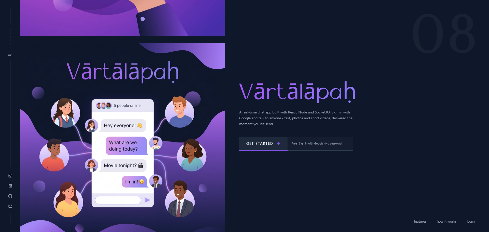

# Vārtālāpaḥ — Real-time Chatting App

A full-stack real-time chat application built on the MERN stack (MongoDB, Express, React, Node.js) with Socket.IO. Sign in with Google and start talking instantly — one-to-one chats, group chats, photo and video sharing, typing indicators, online presence and read receipts, all delivered live over WebSockets.

## 🌐 Live Demo

🚀 **Live Website:** https://vartalapah-chatting-webapp.vercel.app

## 📸 Screenshot

<p align="center">
  
</p>

## Features

### Chat
- Sign in with Google, or create an account with a username, email and password
- Email ownership is verified with a 6-digit code sent to the address — signup
  and password reset both require repeating that code back, so nobody can
  register or take over an address they do not actually receive mail at
- Existing Google accounts can add a password later ("Create Password" screen)
  and log in either way afterwards — same account, never duplicated
- "Forgot password" without an active session: confirm your email, enter the
  code sent to it, set a new password
- One-to-one private chats with any registered user
- Group chats with an admin, member add/remove, and group rename
- Photo and short video sharing, uploaded to Cloudinary (5 MB image / 20 MB video limits)
- Live typing indicator while the other person is writing
- Online / offline presence with a "last seen" timestamp
- Read receipts (blue tick) once a message is opened
- Edit and delete your own messages, reflected instantly on both sides
- Search users by name or email to start a new conversation

### Chat management
- Block and unblock users — a blocked user can no longer reach you, enforced on the server
- Pin important chats to the top of the sidebar
- Archive and hide conversations to keep the list clean
- Sidebar shows the latest message preview, unread state and timestamp for every chat

### Account
- Profile page showing account info (name, email, avatar)
- Light and dark theme toggle, persisted across sessions
- Account deletion gated behind a 6-digit code emailed to the account's own
  address, then performed as a soft delete so the other person's chat history
  stays intact
- Session persists across page refreshes via an httpOnly cookie
- "Remember me" on login for a 30-day session instead of the default 7 days

### Security
- Passwords hashed with bcrypt — never stored or returned in plain text
- CSRF protection (double-submit cookie) on every state-changing request. The
  token is also served from `GET /api/auth/csrf`, because in deployment the
  frontend and API sit on different domains and JavaScript cannot read a cookie
  set by the other one — only the allowed CORS origin can read that response
- Deleting an account needs an emailed code, not just a valid session — the one
  action that cannot be undone is not left to a borrowed or forgotten device
- Rate limiting on all auth endpoints, tuned separately for sensitive
  actions (login, register), lightweight lookups (email checks) and
  outbound email (the code-sending route)
- Google ID tokens verified server-side, including Google's own
  `email_verified` claim — never trusted from the frontend
- Email codes stored as HMAC hashes, never in plain text, with a 10-minute
  expiry, 5 wrong attempts before the code is destroyed, and a 60-second
  per-address resend cooldown

### Mobile
- Composer stays above the on-screen keyboard on both iOS and Android, using the
  `visualViewport` API rather than a fixed-position workaround
- Safe-area padding for the notch, Dynamic Island, gesture bar and URL bar
- Long press a message for a bottom sheet: reply, copy, edit, forward,
  delete for me, unsend
- Full-screen media viewer with pinch and double-tap zoom, and swipe to change
- Android Back closes the open chat, sheet or dialog instead of leaving the site
- Bottom navigation for Chats, Requests, People and Profile
- 44px minimum tap targets throughout

### Landing page
- Full-screen hero: sliding poster marquee on the left, app name and call to action on the right
- Chat bubbles that float up out of the app name — real message cards mixed with photo, video, emoji and read-receipt chips. Desktop only (≥ 1024px); tablet and mobile keep the plain layout
- Sticky navbar that slides in only once the hero has scrolled past
- Sections for stats, features, how it works, use cases, auto-scrolling testimonials and an FAQ accordion
- Scroll-reveal animations on cards, and a click-spark canvas effect across the page
- Every animation is disabled under `prefers-reduced-motion`

## Tech Stack

### Frontend (`/client`)
- React + Vite
- React Router
- Tailwind CSS v4
- Material UI (MUI) components and icons
- Google OAuth (`@react-oauth/google`)
- Socket.IO client for real-time events
- Context API for auth, socket connection and theme
- ESLint (flat config) — `npm run lint`

### Backend (`/server`)
- Node.js + Express
- MongoDB with Mongoose
- Socket.IO for real-time messaging, typing and presence
- Google OAuth verification + JWT session tokens stored in httpOnly cookies
- Two interchangeable mail transports for the verification codes, chosen by
  environment: Nodemailer over plain SMTP (a pooled, kept-warm connection to
  any SMTP account) for local development, and Brevo's HTTPS API in
  deployment, where the host blocks outbound SMTP ports. Neither costs money
- bcryptjs for password hashing
- express-rate-limit on all auth routes
- CSRF protection via a custom double-submit-cookie middleware
- Cloudinary for image and video storage (via Multer + `multer-storage-cloudinary`)
- REST API with route-level middleware for authentication

### External Services

Every one of these runs on a free tier — the project has no running cost.

| Service | What it does here | Free tier | Configured via |
|---|---|---|---|
| [MongoDB Atlas](https://www.mongodb.com/atlas) | Database — users, messages, groups, one-time codes | 512 MB shared cluster | `MONGO_URI`, `DB_NAME` |
| [Cloudinary](https://cloudinary.com) | Stores images and videos sent in chat | 25 GB storage and bandwidth | `CLOUDINARY_*` |
| [Google Cloud Console](https://console.cloud.google.com) | OAuth 2.0 Client ID behind "Sign in with Google" | Free | `GOOGLE_CLIENT_ID` (server + client) |
| Gmail SMTP | Sends the 6-digit verification codes **in local development** | ~500 emails/day | `SMTP_*` + a 16-char App Password |
| [Brevo](https://www.brevo.com) | Sends the same codes **in deployment**, over HTTPS | 300 emails/day, no card | `BREVO_API_KEY` |
| [Render](https://render.com) | Hosts the backend (Express + Socket.IO) | Free instance — sleeps after 15 min idle, blocks SMTP ports | Environment tab |
| [Vercel](https://vercel.com) | Hosts the frontend (built React app) | Free | Project Settings → Environment Variables |

Two of them exist for the same job on purpose: Render's free tier blocks
outbound SMTP, so Gmail SMTP covers local development and Brevo's HTTPS API
covers production. See **[SETUP.md](SETUP.md)** Part 3 and Part 3B.

## Project Structure

```text
Vartalapah-ChattingApp/
├── client/
│   ├── public/
│   ├── src/
│   │   ├── api/              Every network call. Nothing else calls fetch().
│   │   │                     httpClient + one module per resource
│   │   ├── assets/           Fonts and poster images
│   │   ├── components/
│   │   │   ├── auth/         Shared by the signup and password-reset flows
│   │   │   ├── chat/         Only meaningful inside the chat feature
│   │   │   ├── home/         Only meaningful on the landing page
│   │   │   └── ui/           Generic and feature-agnostic
│   │   ├── constants/        Named values, so nothing is a magic number
│   │   ├── context/          Auth, Socket and Theme providers
│   │   ├── hooks/
│   │   │   ├── chat/         Chat logic (messages, list, groups, socket)
│   │   │   └── ui/           Browser logic (keyboard, long press, back button)
│   │   ├── pages/            Home, Login, Signup, ForgotPassword,
│   │   │                     CreatePassword, Chat — one per route
│   │   ├── routes/           The route table
│   │   ├── styles/           Global CSS and shared MUI style objects
│   │   └── utils/            Small pure functions
│   ├── eslint.config.js      ESLint flat config (`npm run lint`)
│   ├── jsconfig.json         Makes the `@/` -> src alias work in editors
│   ├── vercel.json           SPA rewrite for client-side routing
│   └── .env
│
└── server/
    ├── config/               MongoDB and Cloudinary setup
    ├── middleware/           JWT auth guard, CSRF, rate limiting, error handler
    ├── models/               User, Group, Message, EmailOtp
    ├── routes/               auth, users, messages, groups, upload
    ├── socket/               Socket.IO auth, rooms, typing, presence
    ├── utils/                Token, password validation, one-time codes,
    │                         mailer (SMTP + Brevo API), relations,
    │                         group-room helpers
    ├── test-api.js           Automated API test suite
    ├── server.js
    └── .env
```

Imports use an `@` alias for `src`, so moving a file does not break its imports:

```js
import { messageApi } from '@/api/messageApi.js'   // not '../../../api/...'
```

New to the codebase? Read **[PROJECT_EXPLANATION.md](PROJECT_EXPLANATION.md)** —
it walks through the architecture, the auth flow and the real-time flow in plain
language.

## Getting Started

### Prerequisites

- Node.js (v18 or later)
- MongoDB (Local installation or MongoDB Atlas)
- A Cloudinary account (for media uploads)
- A Google Cloud project with an OAuth 2.0 Client ID configured
- An SMTP account for the verification emails — a normal Gmail address with a
  16-character App Password works and costs nothing. Leave it out during local
  development and the codes are printed to the server terminal instead
- A [Brevo](https://www.brevo.com) account **if you intend to deploy** — its
  free tier (300 emails/day, no card) provides the HTTPS sending route that
  works on hosts which block SMTP ports. Not needed to run the app locally

### 1. Clone the Repository

```bash
git clone https://github.com/sachin-codes01/MERN-Projects.git
cd MERN-Projects/Vartalapah-ChattingApp
```

### 2. Backend Setup

Install dependencies:

```bash
cd server
npm install
```

Create a `.env` file inside the `server` directory:

```env
PORT=5000
MONGO_URI=your_mongodb_connection_string
DB_NAME=vartalapah-chatting-webapp
JWT_SECRET=your_jwt_secret
GOOGLE_CLIENT_ID=your_google_oauth_client_id
SMTP_HOST=smtp.gmail.com
SMTP_PORT=465
SMTP_USER=your_email@gmail.com
SMTP_PASS=your_16_char_app_password
SMTP_FROM=Vartalapah <your_email@gmail.com>
BREVO_API_KEY=your_brevo_api_key   # required in deployment, optional locally
CLOUDINARY_CLOUD_NAME=your_cloudinary_cloud_name
CLOUDINARY_API_KEY=your_cloudinary_api_key
CLOUDINARY_API_SECRET=your_cloudinary_api_secret
CLIENT_URL=http://localhost:5173
```

Start the backend server:

```bash
npm run dev
```

### 3. Frontend Setup

Install dependencies:

```bash
cd ../client
npm install
```

Create a `.env` file inside the `client` directory:

```env
VITE_API_URL=http://localhost:5000
VITE_GOOGLE_CLIENT_ID=your_google_oauth_client_id
```

Start the frontend:

```bash
npm run dev
```

The application will be available at:

```text
http://localhost:5173
```

> The frontend uses `strictPort`, so it always runs on `5173`. If that port is busy Vite fails loudly instead of silently moving to `5174` — which would break both CORS and Google login.

## Environment Variables

### Backend (`server/.env`)

```env
PORT=5000
MONGO_URI=your_mongodb_connection_string
DB_NAME=vartalapah-chatting-webapp
JWT_SECRET=your_jwt_secret
GOOGLE_CLIENT_ID=your_google_oauth_client_id
SMTP_HOST=smtp.gmail.com
SMTP_PORT=465
SMTP_USER=your_email@gmail.com
SMTP_PASS=your_16_char_app_password
SMTP_FROM=Vartalapah <your_email@gmail.com>
BREVO_API_KEY=your_brevo_api_key   # required in deployment, optional locally
CLOUDINARY_CLOUD_NAME=your_cloudinary_cloud_name
CLOUDINARY_API_KEY=your_cloudinary_api_key
CLOUDINARY_API_SECRET=your_cloudinary_api_secret
CLIENT_URL=http://localhost:5173
```

`SMTP_FROM` must use the same address as `SMTP_USER`, or the mail fails SPF/DKIM
alignment and lands in spam — the server warns about this on startup. Port `465`
is deliberate: `587` uses STARTTLS, whose first handshake was measured at 57
seconds on a Windows machine with antivirus TLS scanning, versus 1.4 seconds on
`465`. The SMTP block is optional during local development — leave it empty and
verification codes are printed to the server terminal instead. See
**[SETUP.md](SETUP.md)** for generating the Gmail App Password.

`BREVO_API_KEY` selects a different delivery route: when it is set, mail goes out
over Brevo's HTTPS API instead of SMTP, and the `SMTP_*` credentials are ignored
(`SMTP_FROM` / `SMTP_USER` is still read, as the sender address). This is not a
preference — Render's free plan blocks outbound traffic on all SMTP ports (25,
465, 587), so a deployed instance can only send over HTTPS. Locally either route
works.

### Frontend (`client/.env`)

```env
VITE_API_URL=http://localhost:5000
VITE_GOOGLE_CLIENT_ID=your_google_oauth_client_id
```

> Both `.env` files are excluded from version control using `.gitignore`.
> `VITE_API_URL` must not end with a trailing slash — the API client builds requests as `${VITE_API_URL}/api${path}`.

## Testing

```bash
cd server
npm test
```

Runs an automated API test suite covering auth, users, blocking, messages, groups, uploads and account deletion. The script creates its own test users, signs their JWTs directly (no Google login needed) and cleans up all test data from the database when it finishes.

> This suite predates the username/password auth system and does not yet cover
> `/auth/register`, `/auth/login`, `/auth/set-password`, `/auth/reset-password`,
> `/auth/check-email`, `/auth/send-otp` or `/auth/verify-otp`. Those were
> verified manually with live requests during development — extending
> `test-api.js` to cover them is on the future-improvements list.

```bash
cd client
npm run lint
```

Runs ESLint across the frontend — should report zero warnings and zero errors.

A manual browser checklist is available in [TESTING.md](TESTING.md).

## Deployment

- **Frontend** is deployed on [Vercel](https://vercel.com) with the root directory set to `Vartalapah-ChattingApp/client`. Environment variables are set under Project Settings → Environment Variables, and a redeploy is required after any change since Vite bakes `VITE_*` values in at build time.
- **Backend** is deployed on [Render](https://render.com) with the root directory set to `Vartalapah-ChattingApp/server`. Environment variables are set under the service's Environment tab, which triggers an automatic redeploy on save.
- `NODE_ENV=production` must be set on Render so the session cookie is issued with `secure: true` and `sameSite: 'none'`, which is what makes cross-domain login work between Vercel and Render.
- `CLIENT_URL` on Render must match the deployed Vercel URL exactly, since it drives CORS for both the REST API and the Socket.IO connection.
- The Google Cloud Console OAuth Client must have the deployed frontend URL added under **Authorized JavaScript origins** for Google login to work in production.
- The mail variables must be set on Render too — `.env` files are not deployed. Without them the server refuses to send verification codes in production (it does not silently fall back to printing them, which is development-only behaviour), so signup and password reset would both break.
- **`BREVO_API_KEY` is mandatory on Render**, along with `SMTP_FROM` for the sender address. Render's free plan blocks outbound traffic to SMTP ports 25, 465 and 587, so the Nodemailer route that works locally simply times out there — the signup screen would say a code was sent while nothing ever arrives. The Brevo route sends over HTTPS, which is not blocked. `SMTP_HOST` / `SMTP_USER` / `SMTP_PASS` can stay unset in production.
- MongoDB Atlas must allow `0.0.0.0/0` under Network Access, because Render and Vercel do not use fixed outbound IPs.

> The backend runs on Render's free tier, which sleeps after 15 minutes of inactivity. The first request after a sleep can take up to 50 seconds to wake the service.

## Tech Highlights

- MERN Stack Architecture
- Real-time Messaging with Socket.IO Rooms
- Hybrid Auth — Google OAuth and Username/Password, Same Account Either Way
- Emailed One-time Codes as Proof of Email Ownership for Signup and Password Reset, over Free SMTP or a Free HTTPS Mail API
- HMAC-hashed Codes with Expiry, Attempt Limits and Per-address Resend Cooldowns
- Bcrypt Password Hashing, Never Stored or Returned in Plain Text
- CSRF Protection via Double-submit Cookie
- Tiered Rate Limiting on Auth Endpoints
- JWT Session Handling via httpOnly Cookies
- Typing Indicators, Online Presence and Read Receipts
- Cloudinary Media Uploads with Type, Size and Duration Validation
- Group Chats with Admin-controlled Membership
- Block / Pin / Archive Relations through a Single Unified Endpoint
- Soft Delete to Preserve Conversation History
- Custom React Hooks for Chat State Management
- Light / Dark Theme with Context API
- Responsive UI with Tailwind CSS and MUI
- Runtime-measured Hero Animation — Lane Geometry Computed from the Live Layout so Bubbles Never Collide with the Artwork
- Motion Disabled Under `prefers-reduced-motion`
- Automated API Test Suite

## Notes for Contributors

- **Theme colours live in two places.** The dark palette is defined in the `@theme` block of `client/src/styles/index.css`. The light palette is applied as inline CSS variables on `<html>` — from `LIGHT_VARS` in `client/src/context/ThemeContext.jsx`, and again in a small pre-paint script in `client/index.html` so light-mode users never see a flash of dark. **Both lists must be kept in sync.** Inline styles are used rather than a `[data-theme]` CSS rule because Tailwind v4 compiles `@theme` inside a cascade layer, which made overriding it from CSS unreliable.
- **MUI components don't read Tailwind classes.** Shared `sx` values for MUI inputs and dividers live in `client/src/styles/muiStyles.js` and point at the same CSS variables, so they follow the theme too. Avoid hard-coding hex colours in `sx` — import them from `client/src/constants/theme.js` instead. Hard-coded hexes are what previously made input text and placeholders invisible in light mode.
- **`GET /api/auth/me` returns `200` with `user: null`** when no session cookie is present, since being logged out is a normal state and a `401` shows up as a red console error for every visitor. A cookie that is present but invalid or expired still returns `401`.
- **The CSRF token has two sources on purpose.** `httpClient.js` reads the `csrf_token` cookie when it can, and falls back to `GET /api/auth/csrf` when it cannot — which is always the case in deployment, where the cookie belongs to the API's domain and the page runs on another. Do not "simplify" this back to a cookie-only read: that is what made every non-GET request fail with `403` on the live site while working perfectly on localhost.
- **The hero animation is desktop-only and self-measuring.** It reads the rendered width of the app name and the real glyph bounds of the background month number, then derives its lanes from those. Nothing about it is hard-coded to a breakpoint, so changing the heading size or the number does not require touching the animation.
- **`useToast()` returns a new object every render.** `error`/`info` are `useState` values and `setError`/`setInfo` are their setters, but the `{ error, info, setError, setInfo }` wrapper object itself is a fresh literal each time. Effects/callbacks that need `toast` must destructure `setError`/`setInfo` (stable, guaranteed by React) rather than depending on the whole `toast` object, or `react-hooks/exhaustive-deps` either re-fires them every render or has to be silenced. See `useMessages.js`, `useChatList.js` and `useChatSocket.js` for the pattern.
- **`client/eslint.config.js` intentionally skips `eslint-plugin-react`** — at time of writing it isn't compatible with the installed ESLint 10, and its rules aren't essential with React 17+'s JSX transform anyway. Only `eslint-plugin-react-hooks` (pinned to the stable v5, not the v7 line with experimental React Compiler rules) and `eslint-plugin-react-refresh` are used.

## Documentation

| File | What it is for |
|---|---|
| [PROJECT_EXPLANATION.md](PROJECT_EXPLANATION.md) | How the architecture, auth and real-time layers work, in plain language |
| [REFACTOR_REPORT.md](REFACTOR_REPORT.md) | What the cleanup pass changed, and what it deliberately left alone |
| [SETUP.md](SETUP.md) | Longer first-time setup walkthrough |
| [TESTING.md](TESTING.md) | Manual browser test checklist |

## License

This project is for personal and educational purposes. Feel free to fork and modify it for learning.
